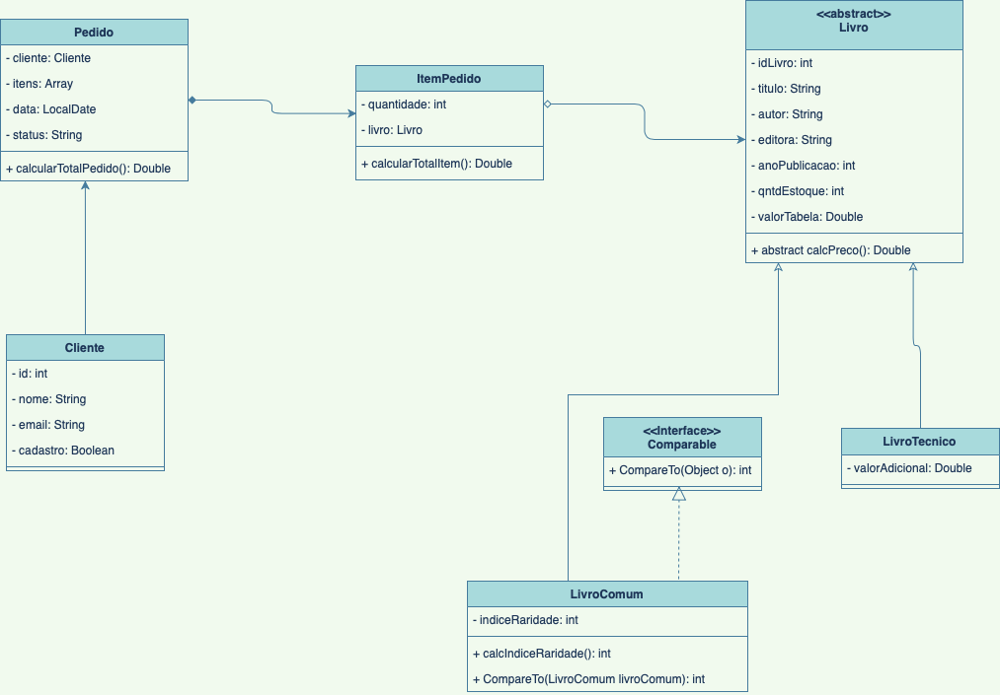

# Programação Orientada a Objetos

## Checkpoint

### Integrantes:

- [Paula Augusto](https://github.com/pcamposaugusto)
- [Silvano Araujo](https://github.com/Silvanoeng)

## Proposta de problema para construção de uma aplicação:

Devido à crise gerada pela pandemia, os donos da livraria **Cosac** perceberam uma diminuição na frequência de seus clientes nas lojas físicas e, consequentemente, uma redução significativa nas vendas. Para solucionar essa questão, os proprietários decidiram implementar um sistema online, interligando a loja física a um site, com o objetivo de vender os livros pela internet, bem como ter um controle automatizado do estoque.

No sistema, os **clientes** se associam aos **pedidos**, que são compostos por **itens pedidos** - afinal, sem os itens não podem haver pedidos. Os dados necessários para o **pedido** são: *cliente, lista de itens pedidos, data e status*. Através do sistema, é possível adicionar e remover itens (livros) do pedido, além de obter o valor total da compra.

No **item pedido** deve constar o *livro* e a *quantidade* pedidas, sendo possível calcular o valor total do mesmo. 

Os **clientes** devem ter *id, nome, e-mail* e devemos saber se estão *cadastrados ou não* no sistema, para evitar duplicação de dados.

Os **livros**, por sua vez, devem ter *id, título, autor(a), editora, ano de publicação, quantidade no estoque e valor tabelado*. No momento de *calcular o preço* dos livros, é preciso levar em conta a divisão entre **livros comuns** e **livros técnicos**, pois sobre estes últimos deve incidir um *valor adicional*. 

Além das características gerais descritas acima, os **livros comuns** possuem uma especificidade: o *índice de raridade* - que será determinado pela quantidade de livros no estoque. Ou seja, quanto mais livros disponíveis, menor o índice de raridade.

Portanto, como podemos ver, o sistema deve ter as seguintes **funcionalidades**:

- Através de um Menu interativo com o usuário, disponibilizar as opções de acesso para os Menus de Clientes, Livros e Pedidos, além da opção Sair do Menu;
- No Menu de Clientes, permitir o cadastro, a impressão, a edição e a exclusão dos Clientes;
- No Menu Editar Clientes, permitir a edição do id, nome e email do Cliente, além da opção de desativar seu cadastro;
- No Menu de Livros, permitir o cadastro, a exclusão e a listagem dos livros - tanto os comuns quanto os técnicos -, possibilitando o cálculo dos preços diferenciados;
- No Menu de Itens Pedidos, possibilitar a adição e a exclusão de itens (livros comuns e técnicos) do pedido, assim como a finalização para o pedido;
- E, por fim, no Menu de pedidos, permitir o cadastro, a impressão do pedido e a exclusão do pedido, apresentando as suas informações e o valor total da compra.

### Diagrama UML de Classes

