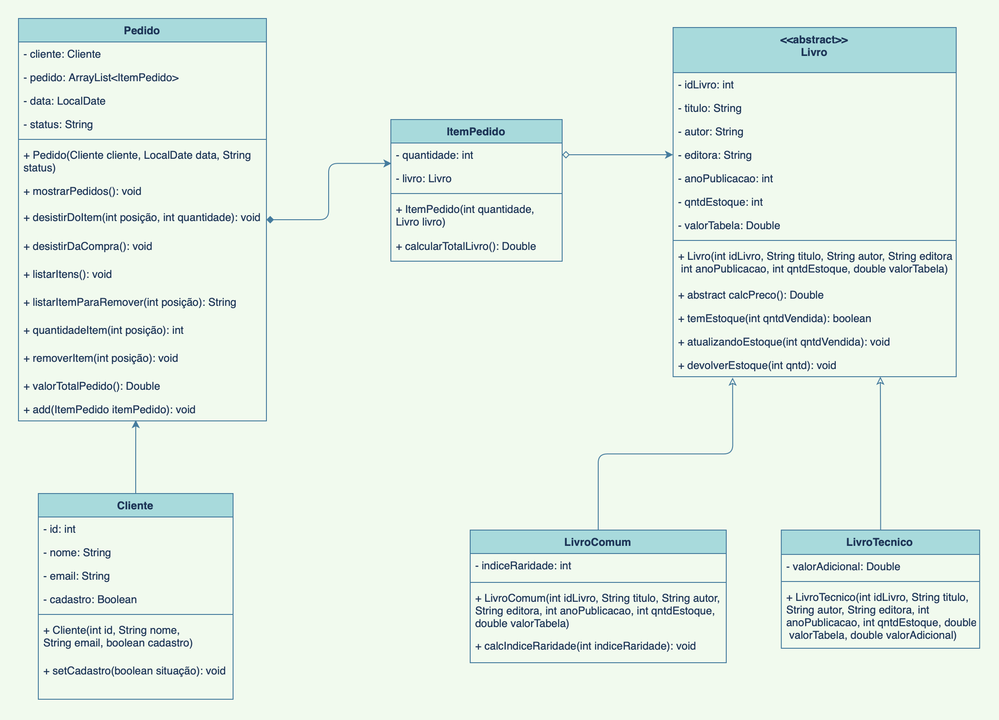

# Programação Orientada a Objetos

## Checkpoint

### Integrantes:

- [Paula Augusto](https://github.com/pcamposaugusto)
- [Silvano Araujo](https://github.com/Silvanoeng)

## Proposta de problema para construção de uma aplicação:

Devido à crise gerada pela pandemia, os donos da livraria **Cosac** perceberam uma diminuição na frequência de seus clientes nas lojas físicas e, consequentemente, uma redução significativa nas vendas. Para solucionar essa questão, os proprietários decidiram implementar um sistema online, interligando a loja física a um site, com o objetivo de vender os livros pela internet, bem como ter um controle automatizado do estoque.

No sistema, os **pedidos** se associam aos **clientes** e são compostos por **livros**, já que sem os livros não podem haver pedidos. Os dados necessários do pedido são: *data*, *status* e *quantidade*. Através do sistema, é possível *adicionar livros* ao pedido, *remover livros* do pedido, além de *obter o valor total da compra*. Os **clientes** devem ter *id*, *nome* e *e-mail*.

Os **livros**, por sua vez, devem ter *id*, *título*, *autor(a)*, *editora*, *ano de publicação*, *quantidade no estoque* e *valor tabelado*. No momento de calcular o preço dos livros, é preciso levar em conta a divisão entre **livros comuns** e **livros técnicos**, pois sobre estes últimos deve incidir um *valor adicional*.

Além das características gerais descritas acima, os livros comuns possuem uma especificidade: o *índice de raridade*, que será determinado pela quantidade de livros no estoque - ou seja, quanto mais livros disponíveis, menor o índice de raridade.

Portanto, como podemos ver, o sistema deve ter as seguintes **funcionalidades**:

- Permitir o cadastro dos clientes e os seus pedidos, podendo adicionar e remover os livros, além de apresentar o valor total da compra.
- Permitir o cadastro dos livros - tanto os comuns quanto os técnicos, permitindo o cálculo dos preços diferenciados.
- Permitir a comparação entre os livros comuns dentro do escopo da raridade.

### Diagrama UML de Classes

